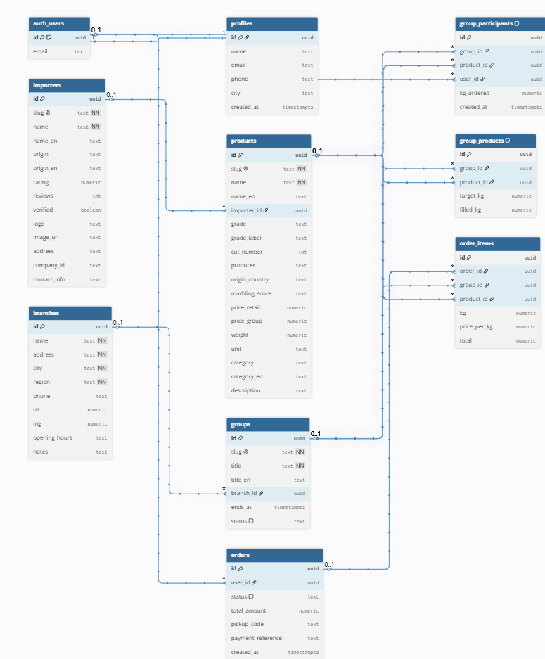

<div align="center">

# 🥩 MeatHub

**פלטפורמת רכישת בשר פרימיום קבוצתית — ישר מהיבואן**


### 🔗 [פרויקט חי](https://meathub-v3.vercel.app) &nbsp;·&nbsp; 💻 [קוד המקור](https://github.com/dolevN96/meathub-v3) &nbsp;·&nbsp; 🗂 [ERD](#-מבנה-הנתונים--erd)

</div>

---

## 📋 סקירה כללית

MeatHub מאפשרת לקבוצות צרכנים להזמין יחד נתחי בשר פרימיום ישירות מהיבואן. כל קבוצה נפתחת לנתח מסוים בנקודת איסוף מסוימת; כשנצבר מספיק ביקוש והקבוצה "נסגרת", כל המשתתפים מחויבים במחיר הסיטונאי — חיסכון של **40–60%** לעומת מחיר קמעונאי, בלי לפגוע באיכות או בשקיפות.

## 🩹 הבעיה שאנחנו פותרים

בשר פרימיום (אנטריקוט מיושן, פילה Black Angus, טומהוק וכו') יקר מאוד בקמעונאות בגלל שכבות תיווך — קצב, סיטונאי, מפיץ — שכל אחד מהן מוסיף עוד מרווח. צרכן פרטי בודד אינו יכול לרכוש בכמות סיטונאית כדי לקבל את המחיר הנמוך, וקבוצות רכישה "מאורגנות יד" (קבוצות וואטסאפ, גיליונות אקסל משותפים) קיימות בפועל אך הן כאוטיות: בלי מעקב מלאי בזמן אמת, בלי תיאום תשלום מאובטח, ובלי שקיפות לגבי שלב הקבוצה.

## 🎯 קהל היעד

צרכנים פרטיים שאוהבים בשר פרימיום ומוכנים להמתין כמה ימים לסגירת קבוצה בתמורה למחיר נמוך משמעותית — בעיקר משקי בית שמזמינים בכמות (אירועים, גריל סוף שבוע, הקפאה לטווח ארוך) ורגישים למחיר לק"ג.

## 🥊 מתחרים ובידול

| חלופה קיימת | החיסור שלה |
|---|---|
| קבוצת וואטסאפ + גיליון Excel משותף | בלי מעקב מלאי בזמן אמת, בלי תשלום מאובטח, תלוי שמישהו "ינהל" את זה ידנית |
| קצבייה / סופרמרקט רגיל | מחיר קמעונאי מלא, בלי שקיפות על מקור הבשר, היבואן או דרגת השומן (BMS) |
| אתרי קבוצות רכישה כלליים (קופונים/דילים) | לא ממוקדים בבשר, בלי נתוני איכות (מגדל, מקור, BMS), חוויית משתמש גנרית |

**איך MeatHub שונה:** מילוי קבוצה מתעדכן בזמן אמת (Supabase Realtime), התשלום מתבצע רק כשהקבוצה נסגרת בפועל (אין סיכון כספי מוקדם), וכל נתח מציג שקיפות מלאה — יבואן, מקור, דרגת שומן (BMS) ומחיר לעומת קמעונאי.

## 👤 בדיקת המוצר / משתמש דמו

לא נדרש משתמש דמו — ההרשמה אמיתית ופועלת מול Supabase Auth. כדי לבדוק את הזרימה המרכזית: היכנסו לקטלוג → בחרו קבוצה פעילה → הוסיפו נתח לעגלה → השלימו הרשמה קצרה → תשלום (כל תשלום הוא דמה, לא מבוצע חיוב אמיתי) → ההזמנה מופיעה בפרופיל וכמות הקבוצה מתעדכנת בזמן אמת.

## 📸 צילומי מסך

> _להוסיף צילומי מסך מהאפליקציה (קטלוג, עמוד קבוצה, עגלה, תשלום) בתיקיית `screenshots/` ולקשר אליהם כאן._

## 🛠 טכנולוגיות

- **React 18** + **Vite 6**
- **Supabase** — Postgres, Auth (אימייל + Google OAuth), Realtime, Row Level Security
- **TanStack Query** — ניהול state של נתונים מהשרת + cache invalidation
- **vite-plugin-singlefile** — build לקובץ HTML יחיד עם כל הנכסים inline
- RTL מלא (עברית), Responsive — Mobile / Tablet / Desktop

## 🔌 שירותים חיצוניים ואינטגרציות

| שירות | סוג | למה משמש |
|---|---|---|
| [Supabase](https://supabase.com) — Postgres | בסיס נתונים | אחסון מוצרים, יבואנים, סניפים, קבוצות, הזמנות, פרופילים — עם RLS |
| Supabase Auth | אוטנטיקציה | הרשמה/כניסה עם אימייל+סיסמה, וכניסה עם Google OAuth |
| Supabase Realtime | Realtime | עדכון חי של כמות שמולאה בכל קבוצה ברגע שמישהו מזמין (`group_products`) |
| Supabase RPC (`checkout_cart`) | לוגיקת שרת | תהליך התשלום כולו רץ כפונקציית Postgres אטומית בשרת — בודקת מלאי, יוצרת הזמנה, מעדכנת קבוצה; מונעת race condition בין משתמשים שמזמינים באותו רגע |
| pg_cron (Supabase) | Job מתוזמן | מריץ אחת לשעה פונקציה שמחדשת תאריך סיום של קבוצות פעילות, כדי שהדמו יישאר "חי" |

## 🗂 מבנה הנתונים — ERD


<!-- TODO: ייצאו PNG מ-dbdiagram.io (ראו הוראות מטה) ושמרו בנתיב screenshots/erd.png -->

9 טבלאות: `profiles`, `importers`, `products`, `branches`, `groups`, `group_products`, `group_participants`, `orders`, `order_items`. מקור הסכמה המלא (כולל RLS ו-RPC): [`supabase/schema_v4.sql`](supabase/schema_v4.sql).

<details>
<summary>📜 קוד DBML — להדבקה ב-<a href="https://dbdiagram.io">dbdiagram.io</a> ליצירת/ייצוא התרשים</summary>

```dbml
// auth.users מנוהל ע"י Supabase Auth ולא חלק מהסכמה שלנו — מופיע כאן רק כדי
// שהתרשים יראה את הקשר האמיתי בין profiles / orders / group_participants למשתמש המחובר.
Table auth_users {
  id uuid [pk, note: 'Supabase-managed (auth.users)']
  email text
}

Table profiles {
  id uuid [pk, ref: - auth_users.id]
  name text
  email text
  phone text
  city text
  created_at timestamptz
}

Table importers {
  id uuid [pk]
  slug text [unique, not null]
  name text [not null]
  name_en text
  origin text
  origin_en text
  rating numeric
  reviews int
  verified boolean
  logo text
  image_url text
  address text
  company_id text
  contact_info text
}

Table products {
  id uuid [pk]
  slug text [unique, not null]
  name text [not null]
  name_en text
  importer_id uuid [ref: > importers.id]
  grade text
  grade_label text
  cut_number int
  producer text
  origin_country text
  marbling_score text
  price_retail numeric
  price_group numeric
  weight numeric
  unit text
  category text
  category_en text
  description text
}

Table branches {
  id uuid [pk]
  name text [not null]
  address text [not null]
  city text [not null]
  region text [not null]
  phone text
  lat numeric
  lng numeric
  opening_hours text
  notes text
}

Table groups {
  id uuid [pk]
  slug text [unique, not null]
  title text [not null]
  title_en text
  branch_id uuid [ref: > branches.id]
  ends_at timestamptz
  status text [note: 'active | closed | cancelled']
}

Table group_products {
  id uuid [pk]
  group_id uuid [ref: > groups.id]
  product_id uuid [ref: > products.id]
  target_kg numeric
  filled_kg numeric

  indexes {
    (group_id, product_id) [unique]
  }
}

Table group_participants {
  id uuid [pk]
  group_id uuid [ref: > groups.id]
  product_id uuid [ref: > products.id]
  user_id uuid [ref: > auth_users.id]
  kg_ordered numeric
  created_at timestamptz

  indexes {
    (group_id, user_id, product_id) [unique]
  }
}

Table orders {
  id uuid [pk]
  user_id uuid [ref: > auth_users.id]
  status text [default: 'pending']
  total_amount numeric
  pickup_code text
  payment_reference text
  created_at timestamptz
}

Table order_items {
  id uuid [pk]
  order_id uuid [ref: > orders.id]
  group_id uuid [ref: > groups.id]
  product_id uuid [ref: > products.id]
  kg numeric
  price_per_kg numeric
  total numeric
}
```

**הוראות:** [dbdiagram.io](https://dbdiagram.io) → New Diagram → מחקו את התוכן הקיים → הדביקו את הקוד מעלה → **Export → Export to PNG** → שמרו כ-`screenshots/erd.png`.

</details>

## 📁 מבנה הפרויקט

```
src/
├── lib/        supabase.js · auth.js · db.js (hooks + realtime) · orders.js (checkout RPC)
├── hooks/      useBreakpoint.js
├── components/ Icon · Btn · GradeBadge · LiveProgressBar · CountdownTimer · Toast · Sidebar · Topbar · BottomNav
└── screens/    LandingPage · HomeScreen · CatalogScreen · GroupsScreen · GroupViewScreen ·
                BranchesScreen · CartScreen · CheckoutScreen · LoginScreen · DashboardScreen

supabase/
├── schema_v4.sql            סכמה מלאה + RLS + RPC checkout_cart
├── schema_v5_live_demo.sql  תיקון trigger הרשמה + רענון אוטומטי של קבוצות (pg_cron)
└── seed_v4.sql               נתוני דמו (יבואנים, סניפים, מוצרים, קבוצות)
```

## 🚀 התקנה והרצה

1. צרו פרויקט ב-[Supabase](https://supabase.com), והריצו לפי הסדר ב-SQL Editor:
   `supabase/schema_v4.sql` → `supabase/seed_v4.sql` → `supabase/schema_v5_live_demo.sql`
2. צרו קובץ `.env` בשורש הפרויקט (**לא** מועלה ל-git):
   ```
   VITE_SUPABASE_URL=https://YOUR_PROJECT.supabase.co
   VITE_SUPABASE_ANON_KEY=YOUR_ANON_KEY
   ```
3. הרצה:
   ```bash
   npm install
   npm run dev
   ```

## 📦 בנייה לפרודקשן / דיפלוימנט

```bash
npm run build
```

מפיק `dist/index.html` בודד (כל ה-JS/CSS inline). דיפלוימנט ל-Vercel:

```bash
npx vercel login
npx vercel --prod
```

יש להגדיר את `VITE_SUPABASE_URL` ו-`VITE_SUPABASE_ANON_KEY` ב-**Vercel → Settings → Environment Variables** — הן נדרשות בזמן ה-build, לא רק בזמן ריצה.

---

<details>
<summary>✅ צ'קליסט הגשה</summary>

- [x] README כולל סקירה, בעיה, קהל יעד, מתחרים ובידול
- [x] תרשים ERD (DBML מוכן ל-dbdiagram.io)
- [x] רשימת שירותים חיצוניים מפורטת
- [x] `.env` לא מועלה לריפו (מאומת ב-`.gitignore` + היסטוריית git)
- [x] לא נדרש משתמש דמו — הרשמה אמיתית
- [x] קישור Vercel חי — https://meathub-v3.vercel.app
- [ ] ריפו GitHub ציבורי (לוודא visibility)
- [ ] צילומי מסך + ERD PNG בתיקיית `screenshots/`

</details>
