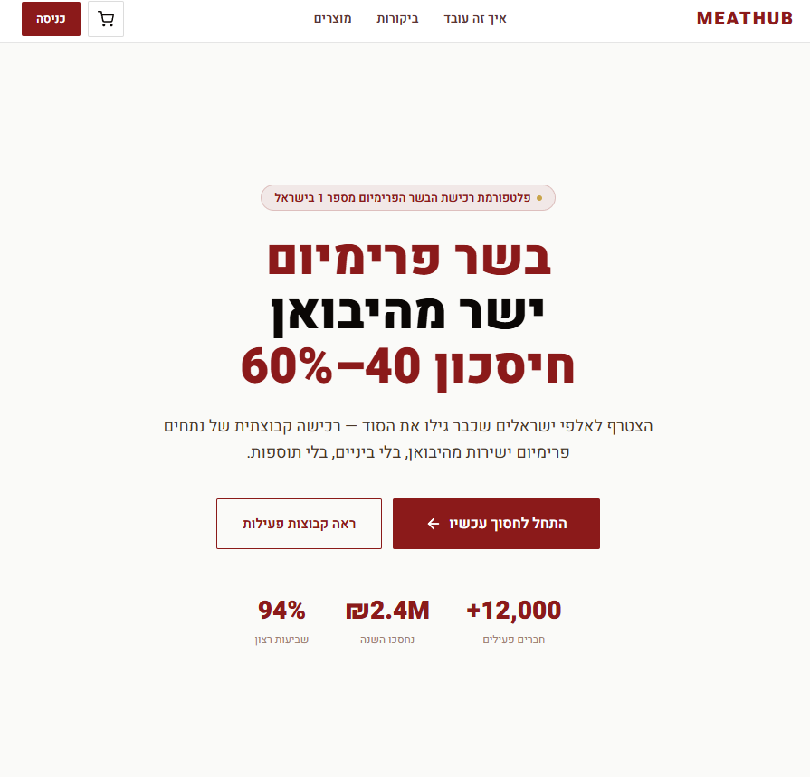
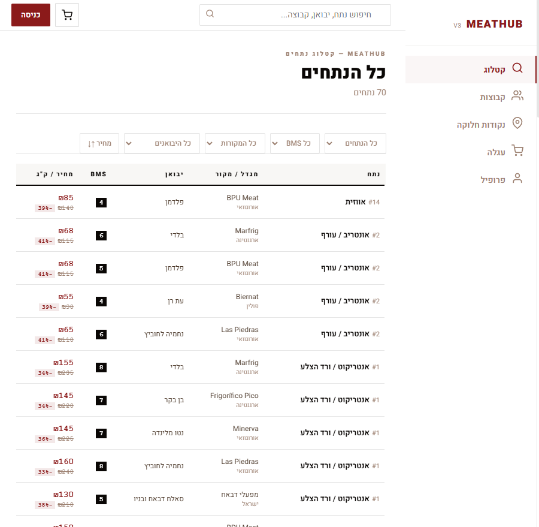
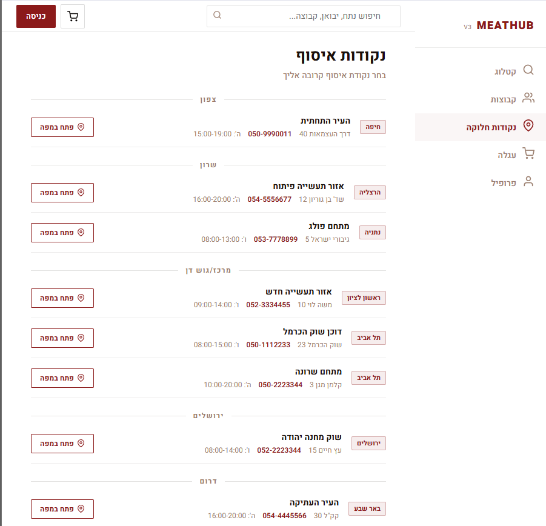
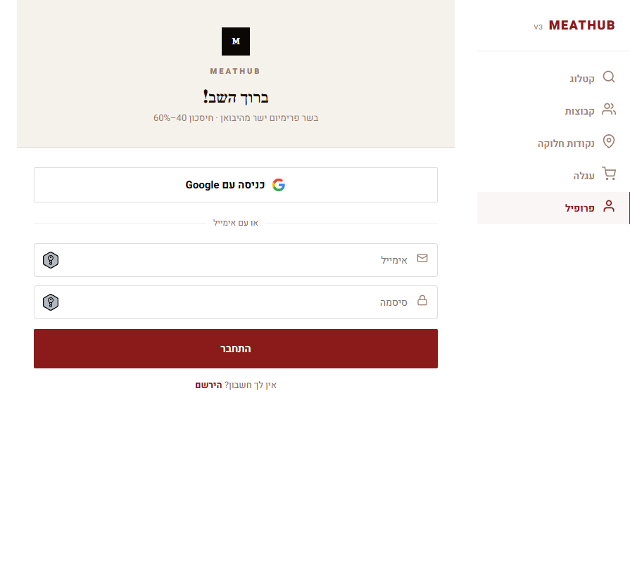
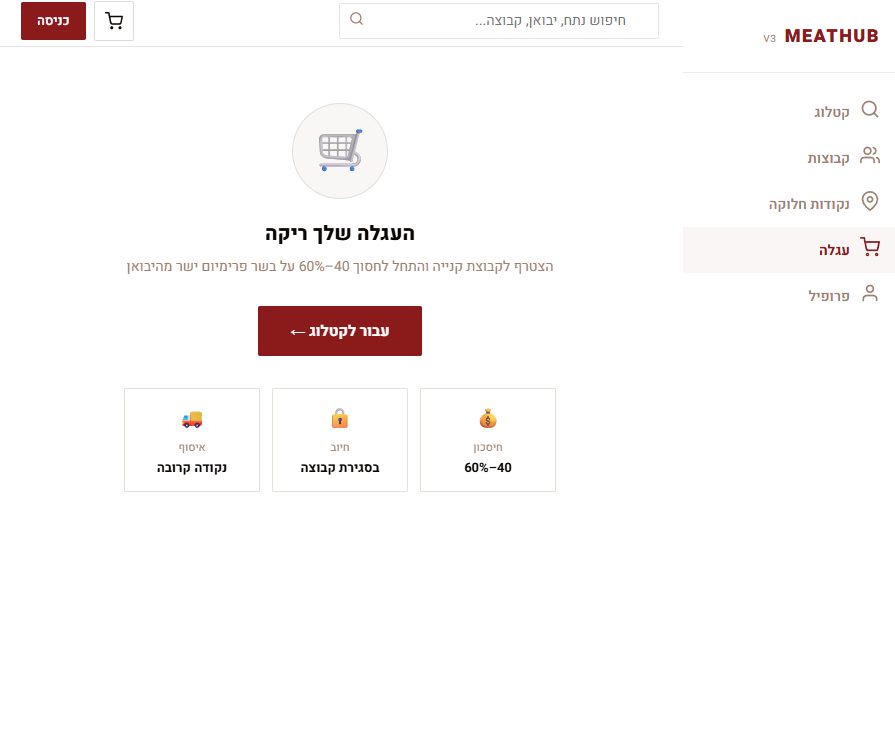
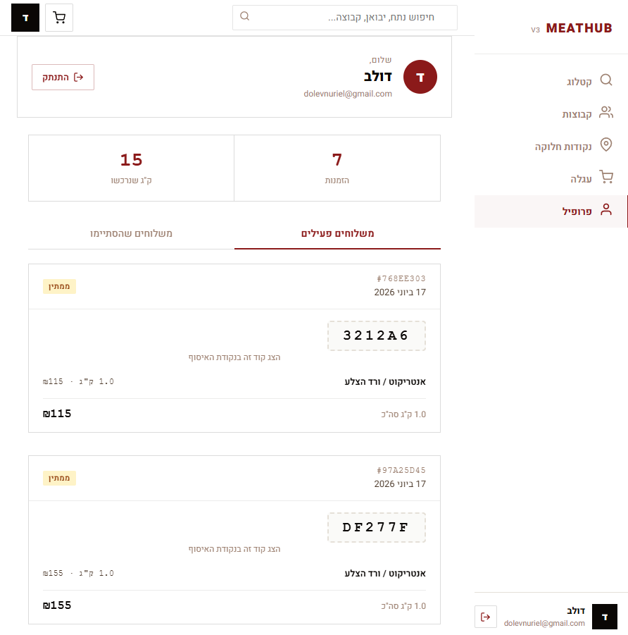

<div align="center">

# 🥩 MeatHub

**פלטפורמת רכישת בשר פרימיום קבוצתית — ישר מהיבואן**


### 🔗 [פרויקט חי](https://meathub-v3.vercel.app) &nbsp;·&nbsp; 💻 [קוד המקור](https://github.com/dolevN96/meathub-v3) &nbsp;·&nbsp; 🗂 [ERD](#-מבנה-הנתונים--erd)

</div>

- 🔗 פרויקט חי: https://meathub-v3.vercel.app
- 💻 קוד המקור: https://github.com/dolevN96/meathub-v3

---

## 📋 סקירה כללית

MeatHub מאפשרת לקבוצות צרכנים להזמין יחד נתחי בשר פרימיום ישירות מהיבואן. כל קבוצה נפתחת לנתח מסוים בנקודת איסוף מסוימת; כשנצבר מספיק ביקוש והקבוצה "נסגרת", כל המשתתפים מחויבים במחיר הסיטונאי — חיסכון של **40–60%** לעומת מחיר קמעונאי, בלי לפגוע באיכות או בשקיפות.

## 🩹 הבעיה שאנחנו פותרים

בשר פרימיום (אנטריקוט מיושן, פילה Black Angus, טומהוק וכו') יקר מאוד בקמעונאות בגלל שכבות תיווך — קצב, סיטונאי, מפיץ — שכל אחד מהן מוסיף עוד מרווח. צרכן פרטי בודד אינו יכול לרכוש בכמות סיטונאית כדי לקבל את המחיר הנמוך, וקבוצות רכישה "מאורגנות יד" (קבוצות וואטסאפ, גיליונות אקסל משותפים) קיימות בפועל אך הן כאוטיות: בלי מעקב מלאי בזמן אמת, בלי תיאום תשלום מאובטח, ובלי שקיפות לגבי שלב הקבוצה.

## 🎯 קהל היעד

צרכנים פרטיים שאוהבים בשר פרימיום ומוכנים להמתין כמה ימים לסגירת קבוצה בתמורה למחיר נמוך משמעותית — בעיקר משקי בית שמזמינים בכמות (אירועים, גריל סוף שבוע, הקפאה לטווח ארוך) ורגישים למחיר לק"ג.

## 🥊 מתחרים ובידול

| חלופה קיימת | החיסור שלה |
|---|---|
| קבוצת וואטסאפ + גיליון Excel משותף | בלי מעקב מלאי בזמן אמת, בלי תשלום מאובטח, תלוי שמישהו "ינהל" את זה ידנית |
| קצבייה / סופרמרקט רגיל | מחיר קמעונאי מלא, בלי שקיפות על מקור הבשר, היבואן או דרגת השומן (BMS) |
| אתרי קבוצות רכישה כלליים (קופונים/דילים) | לא ממוקדים בבשר, בלי נתוני איכות (מגדל, מקור, BMS), חוויית משתמש גנרית |

**איך MeatHub שונה:** מילוי קבוצה מתעדכן בזמן אמת (Supabase Realtime), התשלום מתבצע רק כשהקבוצה נסגרת בפועל (אין סיכון כספי מוקדם), וכל נתח מציג שקיפות מלאה — יבואן, מקור, דרגת שומן (BMS) ומחיר לעומת קמעונאי.

## 👤 בדיקת המוצר / משתמש דמו

לא נדרש משתמש דמו — ההרשמה אמיתית ופועלת מול Supabase Auth. כדי לבדוק את הזרימה המרכזית: היכנסו לקטלוג → בחרו קבוצה פעילה → הוסיפו נתח לעגלה → השלימו הרשמה קצרה → תשלום (כל תשלום הוא דמה, לא מבוצע חיוב אמיתי) → ההזמנה מופיעה בפרופיל וכמות הקבוצה מתעדכנת בזמן אמת.

## 📸 צילומי מסך

| דף הבית | קטלוג + סינון | עמוד קבוצה |
|---|---|---|
|  |  |  |

| כניסה / הרשמה | עגלה | פרופיל |
|---|---|---|
|  |  |  |

## 🛠 טכנולוגיות

- **React 18** + **Vite 6**
- **Supabase** — Postgres, Auth (אימייל + Google OAuth), Realtime, Row Level Security
- **TanStack Query** — ניהול state של נתונים מהשרת + cache invalidation
- **vite-plugin-singlefile** — build לקובץ HTML יחיד עם כל הנכסים inline
- RTL מלא (עברית), Responsive — Mobile / Tablet / Desktop

## 🔌 שירותים חיצוניים ואינטגרציות

| שירות | סוג | למה משמש |
|---|---|---|
| [Supabase](https://supabase.com) — Postgres | בסיס נתונים | אחסון מוצרים, יבואנים, סניפים, קבוצות, הזמנות, פרופילים — עם RLS |
| Supabase Auth | אוטנטיקציה | הרשמה/כניסה עם אימייל+סיסמה, וכניסה עם Google OAuth |
| Supabase Realtime | Realtime | עדכון חי של כמות שמולאה בכל קבוצה ברגע שמישהו מזמין (`group_products`) |
| Supabase RPC (`checkout_cart`) | לוגיקת שרת | תהליך התשלום כולו רץ כפונקציית Postgres אטומית בשרת — בודקת מלאי, יוצרת הזמנה, מעדכנת קבוצה; מונעת race condition בין משתמשים שמזמינים באותו רגע |
| pg_cron (Supabase) | Job מתוזמן | מריץ אחת לשעה פונקציה שמחדשת תאריך סיום של קבוצות פעילות, כדי שהדמו יישאר "חי" |

## 🗂 מבנה הנתונים — ERD


9 טבלאות: `profiles`, `importers`, `products`, `branches`, `groups`, `group_products`, `group_participants`, `orders`, `order_items`. מקור הסכמה המלא (כולל RLS ו-RPC): [`supabase/schema_v4.sql`](supabase/schema_v4.sql).

## 📁 מבנה הפרויקט

```
src/
├── lib/        supabase.js · auth.js · db.js (hooks + realtime) · orders.js (checkout RPC)
├── hooks/      useBreakpoint.js
├── components/ Icon · Btn · GradeBadge · LiveProgressBar · CountdownTimer · Toast · Sidebar · Topbar · BottomNav
└── screens/    LandingPage · HomeScreen · CatalogScreen · GroupsScreen · GroupViewScreen ·
                BranchesScreen · CartScreen · CheckoutScreen · LoginScreen · DashboardScreen

supabase/
├── schema_v4.sql            סכמה מלאה + RLS + RPC checkout_cart
├── schema_v5_live_demo.sql  תיקון trigger הרשמה + רענון אוטומטי של קבוצות (pg_cron)
└── seed_v4.sql               נתוני דמו (יבואנים, סניפים, מוצרים, קבוצות)
```
